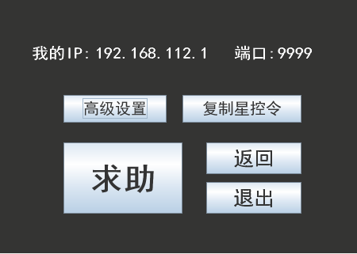
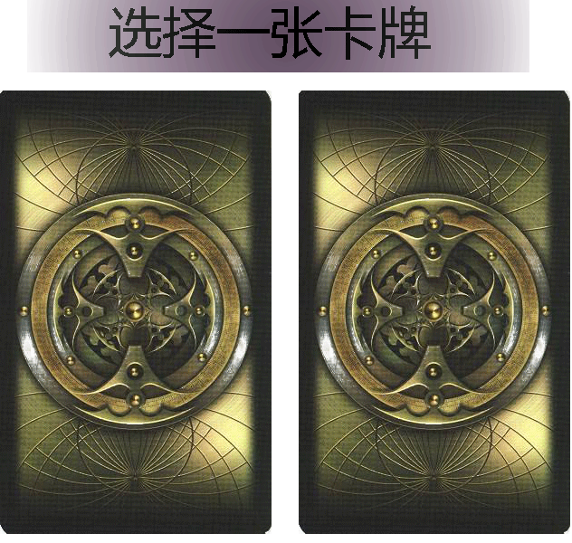
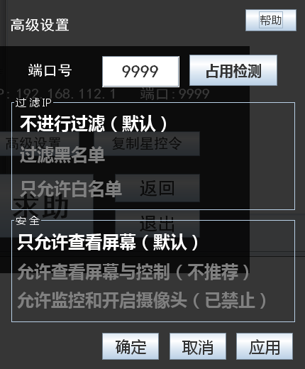

# 🖥️ 星控远程协助系统 🖱️
[]()
[]()
[](https://github.com/ChinaLym)

Java GUI 简单实现的一个远程控制（远程协助）程序 🎥，功能： 远程+查看桌面+控制。

# 运行：
1. 下载：
```
git clone https://github.com/ChinaLym/StarMonitor
```
2. 直接运行：
```bash
java -jar StarMonitor.jar
```

# 🌟 功能

求助者——高级设置（IP过滤、权限设置）——发出求助。



左边是求助者，右边是协助者






协助者——（先尝试使用已经复制的星控令连接）——设置协助坐标（IP + Port）。

过程中，双方可以使用聊天功能进行交流，除此之外，协助方可以给求助者屏幕上发出自定义样式的文字，帮助求助方，还可以控制求助方的计算机。

双方随时都可以中断通信。

支持1对多（多个协助者连接一个求助者）

快捷键：快速中断、退出，一键呼出界面。

## 代码结构

```text
    │  ├─control      与协助方（控制方相关）
    │  ├─obj          常用对象
    │  ├─resort       求助方
    │  │  └─thread      求助方线程
    │  ├─screen       捕获屏幕工具类
    │  ├─UI           可复用的UI界面
    │  │  └─StarComponents
    │  └─Util         工具类
    └─melloware	     （windows 快捷键-注册表相关）
        └─jintellitype
```


## 源码调试运行

- 运行 `com.lym.UI.StartUi` 的 `main` 方法

## 环境依赖

- 操作系统：`windows`/`linux`/`mac`
- JDK：`1.8`，

## 关于星控

设计上分为两种使用者: 求助者 + 协助方。协助方可以根据IP 和 port 或者是 求助方发来的`星控令` 直连对方。

设计初衷在于协助，而不是监控，也就是说求助者有权控制协助方的动作。

## UI 说明

星星离我们很远，占卜师可以查看远处，此为名称由来。

因此UI采用占卜扑克为初始画面，界面为深色风格、透明风格，与星星相符。又加上该程序是初学者所编写，此为难看UI由来。

## 其他

- 可以把该程序作为 Java 初学者学习`GUI` + `网络编程` 的例子。

- 该程序是初学Java时写的代码，没有用任何包管理的程序，没有性能优化措施，没有网络穿透功能。


