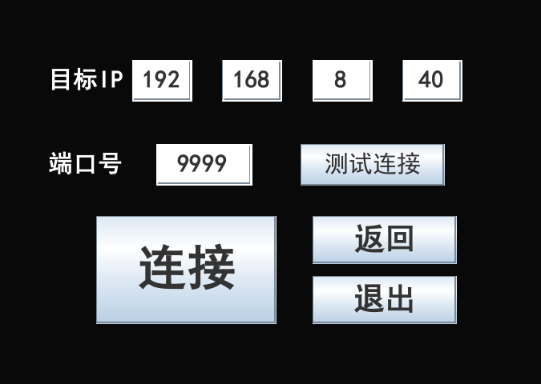

# 🖥️ 星控远程协助系统 🖱️
[]()
[]()
[](https://github.com/ChinaLym)

Java GUI 简单实现的一个远程控制（远程协助）程序 🎥，功能： 远程+查看桌面+控制。

# 🚀 运行：
1. 下载：
```
git clone https://github.com/ChinaLym/StarMonitor
```
2. 直接运行：
```bash
java -jar StarMonitor.jar
```

# 🌟 功能

* 📺 **屏幕查看**：协助者可以看到对方的屏幕内容。
* ✋ **远程控制**：获得权限后，可帮助对方操作电脑。
* 😃 **支持聊天**：一旦连接建立，即可聊天交流。
* 📐 **教学模式**：用文字或画笔指导求助者。
* 👥 **支持1对多**：多个协助者可以连接同一求助者。
* ⚡ **高性能**：多种顶尖帧率压缩算法，降低传输带宽压力100+倍。
* 💡 **快捷键**：迅速中断、退出，一键操作。
* 🔒 **安全性**：随时可以中断通信，保证隐私。

# 🎨 UI 界面
想共享屏幕（求助者）选👈左边；

想查看/操作对方屏幕（协助者）选👉右边


求助者页面


> 可以复制星控令给协助者，以减少他人输入 IP、端口号的操作~


求助者——高级设置（IP过滤、权限设置）——发出求助。


协助者——设置协助坐标（IP + Port）
> 进入协助者身份前，若复制了星控令，则会直接进入远程连接画面哦~



# ❓ FAQ
- [若您遇到问题也优先参考 doc / FAQ.md 或使用 ISSUE 留言👈](doc/FAQ.md)

# 🔬 更多

- [如果您想了解设计细节、源码结构、命名由来、涉及技术等可在 doc / design.md 查看👈](doc/design.md)
