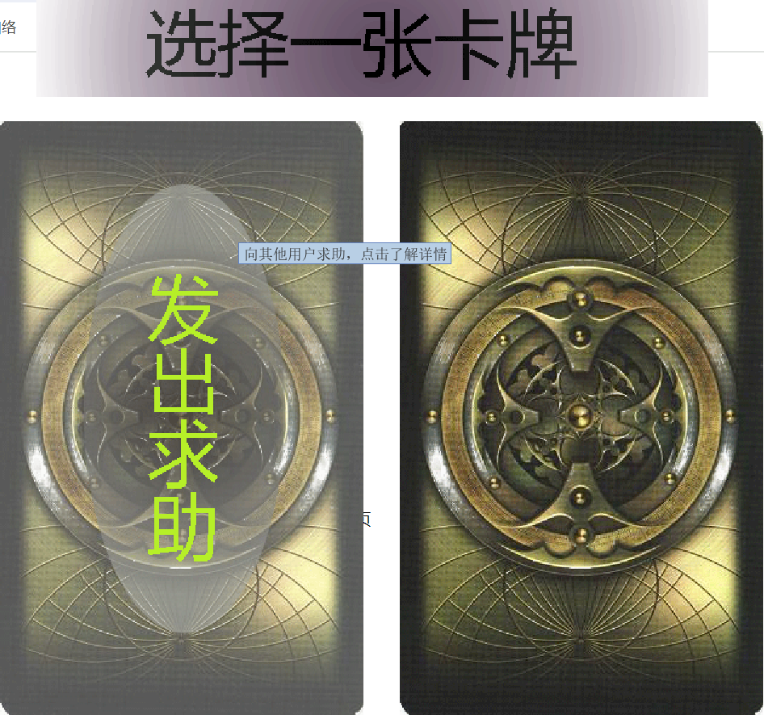

# 🖥️ 星控远程协助系统 🖱️
[]()
[]()
[](https://github.com/ChinaLym)

Java GUI 简单实现的一个远程控制（远程协助）程序 🎥，功能： 远程+查看桌面+控制。

# 🚀 运行：
1. 下载：
```
git clone https://github.com/ChinaLym/StarMonitor
```
2. 直接运行：
```bash
java -jar StarMonitor.jar
```

# 🌟 功能

📺 屏幕查看：协助者可以看到对方屏幕内容。

✋ 远程控制：可在对方允许时远程控制求助方的鼠标、键盘，帮助对方操作电脑。

😃 支持聊天：双方成功连接时，双方可以使用聊天框功能进行交流

💡 快捷键：快速中断、退出，一键呼出界面。

📐 教学模式：协助方可以给求助者屏幕上发文字 / 画笔（指导），以帮助对方

👥 支持1对多：多个协助者连接一个求助者（分享自己的屏幕给多人）

🔒 安全：双方随时都可以中断通信。

# 🎨 UI 界面
想共享屏幕（求助者）选👈左边；

想查看/操作对方屏幕（协助者）选👉右边



求助者页面


求助者——高级设置（IP过滤、权限设置）——发出求助。


协助者——（先尝试使用已经复制的星控令连接）——设置协助坐标（IP + Port）。


# ❓ FAQ
- [若您遇到问题也优先参考 doc / FAQ.md 或使用 ISSUE 留言👈](doc/FAQ.md)

# 🔬 更多

- [如果您想了解设计细节、源码结构、命名由来、涉及技术等可在 doc / design.md 查看👈](doc/design.md)
